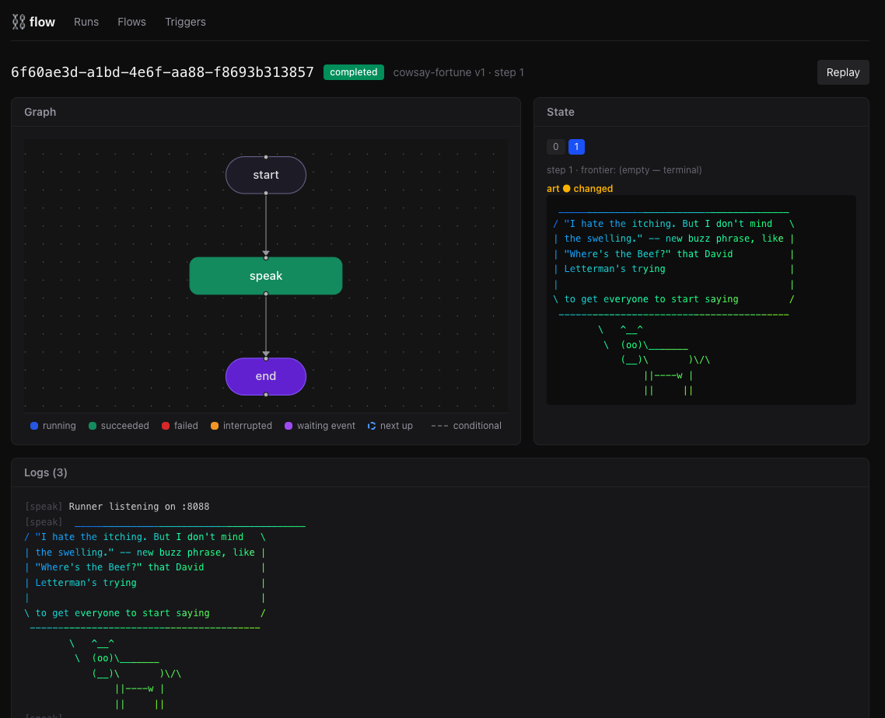
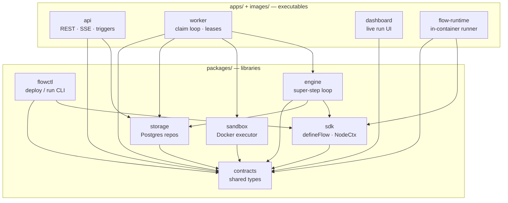
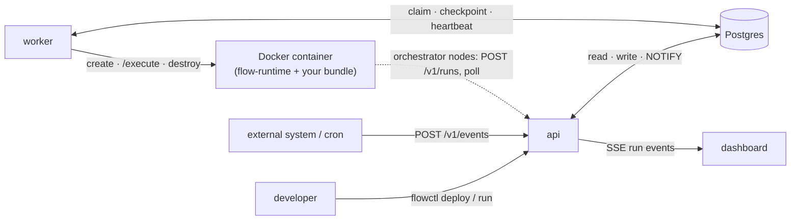

# State machines as a service

A LangGraph-platform-style flow executor: you define a typed state machine in TypeScript,
the platform runs it with a checkpoint after every step — so runs can pause for a human,
wait for external events, survive worker crashes, and resume exactly where they stopped.
Node logic executes in sandboxed Docker containers with a persistent per-run workspace.



## Quick start

```sh
pnpm install
docker compose up -d --wait postgres
pnpm db:migrate
pnpm build
pnpm build:image   # base image for flow containers (bundles runner, then docker build)

# terminal 1 — API (REST + SSE + cron/event triggers), port 4000
node apps/api/dist/main.js
# terminal 2 — worker (claims runs, drives containers)
node apps/worker/dist/main.js
# terminal 3 — dashboard, port 5173
pnpm --filter @flow/dashboard dev

# deploy an example and start a run
node packages/flowctl/dist/main.js deploy examples/repo-ci/src/index.ts
node packages/flowctl/dist/main.js run repo-ci --input '{"repoUrl":"https://github.com/octocat/Hello-World.git","setupCommand":"true","testCommand":"test -f README"}'
```

## Defining a flow

```ts
import { z } from "zod";
import { appendChannel, channel, defineFlow, END } from "@flow/sdk";

const flow = defineFlow("repo-ci", {
  repoUrl: channel({ schema: z.string(), default: () => "" }),
  testExitCode: channel({ schema: z.number(), default: () => -1 }),
  history: appendChannel(z.string()),          // reducer merges parallel writes
})
  .addNode("clone", async (state, ctx) => {
    await ctx.exec(`git clone ${state.repoUrl} repo`);   // runs in /workspace
    return { history: ["cloned"] };
  })
  .addNode("test", async (state, ctx) => {
    const { exitCode } = await ctx.exec("npm test", { cwd: "repo" });
    return { testExitCode: exitCode };
  })
  .addNode("askHuman", async (state, ctx) => {
    const answer = await ctx.interrupt({ question: "Tests failed — proceed?" });
    // run pauses here; resumes with the human's answer
    return { history: [`human said ${JSON.stringify(answer)}`] };
  })
  .addEdge("clone", { kind: "static", to: "test" })
  .addEdge("test", {
    kind: "conditional",
    targets: ["askHuman", END],
    route: (s) => (s.testExitCode === 0 ? END : "askHuman"),
  })
  .addEdge("askHuman", { kind: "static", to: "test" })
  .setEntry("clone")
  .addTrigger({ kind: "cron", schedule: "0 6 * * *" });  // or { kind: "event", topic: "..." }

export default flow;   // or: export const flows = [a, b]
```

Node names accumulate as a string-literal union, so edge targets are compile-time checked.
`ctx.waitForEvent("topic")` pauses until `POST /v1/events/:topic`; use dynamic topics
(e.g. `` `approval:${id}` ``) for correlation.

When a node calls `ctx.interrupt(payload)` the run pauses and the dashboard renders the
payload plus a response form; submitting a value resumes the run from that node.


### Execution semantics

- **Super-steps.** Each step runs the whole frontier in parallel, collects the nodes'
  partial-state writes, merges them deterministically, evaluates edges, and saves a
  checkpoint — all in one transaction.
- **Channels & reducers.** A channel without a reducer accepts one write per step
  (two parallel writes = error). Reducers are named built-ins (`append`, `merge`,
  `sum`, `max`, `min`) so the host can merge without loading user code.
- **Fan-out / fan-in.** `fanOut` edges activate several nodes; a node with multiple
  static in-edges waits for all branches (`pending_joins` in the checkpoint).
- **Interrupts.** `ctx.interrupt()` aborts the node and persists the run. On resume the
  node **re-executes from the top** and the interrupt call returns the stored answer —
  keep side effects before an interrupt idempotent.
- **At-least-once.** A node that succeeded in a step is never re-run after a crash
  (recorded per-task), but an in-flight node may execute twice — key external side
  effects by `runId:step:node`.

## Architecture

**Build-time dependencies** — who imports whom (arrow = "depends on"). Everything bottoms
out at `contracts`, the zero-dependency type vocabulary the whole system shares.



**Runtime data flow** — the same pieces at run time. The API and worker never call each
other directly; they coordinate entirely through Postgres (`SKIP LOCKED` claim +
`LISTEN/NOTIFY` wakeups). The worker drives one Docker container per active run, and node
code inside it can even call back into the API (as `feature-pipeline` does).



## Pieces

| path | what it is |
|---|---|
| `packages/contracts` | shared types, zero deps |
| `packages/sdk` | `defineFlow`, channels, `NodeCtx` — what user code imports |
| `packages/storage` | Postgres repos, migrations, SKIP LOCKED claim + LISTEN/NOTIFY |
| `packages/engine` | the super-step run loop |
| `packages/sandbox` | Docker executor: one container per active run, `ws-<runId>` volume |
| `packages/flowctl` | CLI: `deploy`, `run`, `runs`, `status`, `logs`, `respond`, `event` |
| `apps/api` | Fastify REST + SSE streams + cron/event trigger dispatch |
| `apps/worker` | claims runs, heartbeats leases, drives containers |
| `apps/dashboard` | live run graph, checkpoint/state inspector, interrupt forms |
| `images/flow-runtime` | base image; `flowctl deploy` layers your bundle on top |

`flowctl deploy` bundles your flow with esbuild, builds `flows/<id>:<hash>` from the
base image, and registers the manifest — workers then run that image for each run.
For a flow that needs extra system tools, `flowctl deploy --dockerfile <path>` builds from
your own Dockerfile (which must `FROM platform/flow-runtime`), giving each flow its own
execution environment — see [`examples/cowsay`](examples/cowsay).

Auth is open by default for local dev; set `FLOW_API_KEY` on the API to require
`Authorization: Bearer <key>` (flowctl picks it up from the same env var).

## Tests

```sh
pnpm test   # storage + engine run against flow_test_storage / flow_test_engine
```

## License

Source-available under the [Elastic License 2.0](LICENSE) (`Elastic-2.0`) — free to use,
modify, and self-host; you may not offer it to third parties as a hosted or managed service.
