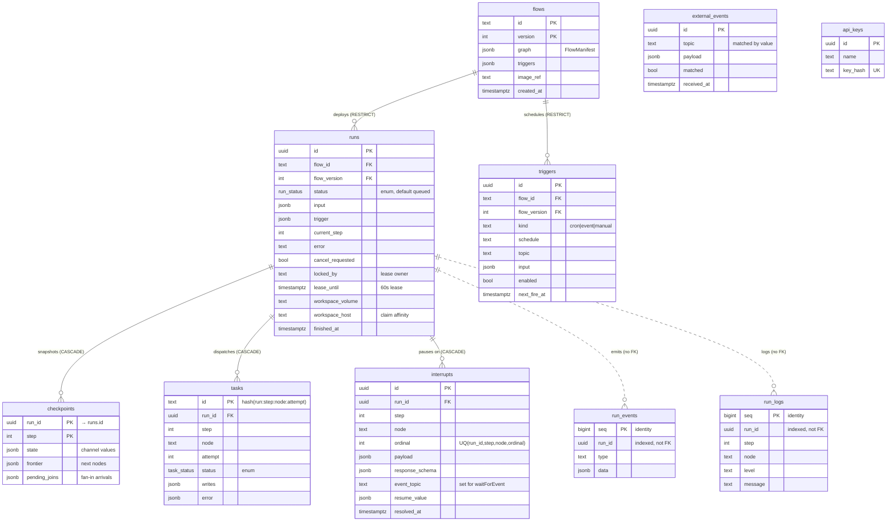

# @flow/storage

Postgres persistence for the platform: the schema, typed repositories, the
`FOR UPDATE SKIP LOCKED` claim, lease/heartbeat queries, and `LISTEN/NOTIFY` helpers.
Depends only on `@flow/contracts` — it holds **all** state, and the API and worker
coordinate exclusively through it (they never call each other directly).

The schema lives in [`migrations/001_init.sql`](migrations/001_init.sql): 9 tables + 2 enums.

## Data model



`external_events` and `api_keys` carry no foreign keys — they stand alone (so the diagram
lists them unconnected).

### Relationship map

```
flows (id, version)  ──1──∞── runs            FK (flow_id, flow_version)   RESTRICT
                     └─1──∞── triggers         FK (flow_id, flow_version)   RESTRICT

runs (id)            ──1──∞── checkpoints      FK run_id                    ON DELETE CASCADE
                     ├─1──∞── tasks            FK run_id                    ON DELETE CASCADE
                     ├─1──∞── interrupts       FK run_id                    ON DELETE CASCADE
                     ├─1──∞·· run_events       run_id column, NO FK         (append-only stream)
                     └─1──∞·· run_logs         run_id column, NO FK         (append-only stream)

external_events      standalone — tied to interrupts/triggers only by matching `topic`
api_keys             standalone
```

## Design choices worth knowing

- **Cascade asymmetry.** `checkpoints` / `tasks` / `interrupts` are FK-bound to `runs` with
  `ON DELETE CASCADE` — deleting a run drops its execution state. `run_events` / `run_logs`
  deliberately have **no FK** (just an indexed `run_id`): they are append-only observability
  streams written in the same transaction as the state change, kept independent of run
  lifecycle. `runs → flows` is **RESTRICT**, so a flow version with runs can't be dropped.
- **`tasks.id` is deterministic** — `hash(runId:step:node:attempt)`. A node that already
  `succeeded` is never re-run after a crash; this row is the idempotency record.
- **Checkpoint is the unit of resume.** `(state, frontier, pending_joins)` at `(run_id, step)`
  is everything a fresh worker needs to continue — no in-memory state survives a restart.
- **Interrupts carry their own resume key.** `unique (run_id, step, node, ordinal)` matches a
  stored response back to the exact `ctx.interrupt()` / `ctx.waitForEvent()` call on re-execution.

### Enums

| enum | values |
|---|---|
| `run_status` | `queued` · `running` · `interrupted` · `waiting_event` · `completed` · `failed` · `cancelled` |
| `task_status` | `dispatched` · `succeeded` · `failed` · `interrupted` |

### Indexes that encode behavior

| index | table | purpose |
|---|---|---|
| `runs_claim_idx` *(partial: status in queued/running)* | runs | the `FOR UPDATE SKIP LOCKED` worker claim |
| `runs_list_idx (flow_id, created_at desc)` | runs | dashboard run listing |
| `tasks_run_step_idx (run_id, step)` | tasks | idempotent skip-on-resume lookup |
| `interrupts_pending_topic_idx` *(partial: unresolved + topic)* | interrupts | event → waiting-interrupt matching |
| `triggers_cron_idx` / `triggers_topic_idx` *(partial: enabled)* | triggers | cron poll & event dispatch |
| `run_events_run_idx (run_id, seq)` | run_events | SSE tail by sequence |

## Repositories

One module per table area; each exports typed query functions over a `pg.Pool` or transaction.

| source | tables it owns |
|---|---|
| [`src/flows.ts`](src/flows.ts) | `flows` (deploy / version lookup) |
| [`src/runs.ts`](src/runs.ts) | `runs` — `createRun`, `claimRun`, `heartbeat`, status transitions |
| [`src/checkpoints.ts`](src/checkpoints.ts) | `checkpoints` — save / latest / list |
| [`src/tasks.ts`](src/tasks.ts) | `tasks` — per-attempt records for idempotent replay |
| [`src/interrupts.ts`](src/interrupts.ts) | `interrupts` — pause, resolve, pending-by-topic |
| [`src/triggers.ts`](src/triggers.ts) | `triggers` — sync from manifest, cron due, enable/disable |
| [`src/run-events.ts`](src/run-events.ts) | `run_events` + `run_logs` — append + tail; emits the `RUN_WAKEUP_CHANNEL` `NOTIFY` |
| [`src/api-keys.ts`](src/api-keys.ts) | `api_keys` |
| [`src/notify.ts`](src/notify.ts) | `listen` — the `LISTEN` side of the wakeup channel |
| [`src/db.ts`](src/db.ts) | pool creation, `withTransaction` |
| [`src/migrate.ts`](src/migrate.ts) · [`src/migrate-cli.ts`](src/migrate-cli.ts) | runs `migrations/*.sql` (`pnpm db:migrate`) |

## Tests

```sh
pnpm --filter @flow/storage test   # integration tests against flow_test_storage
```
